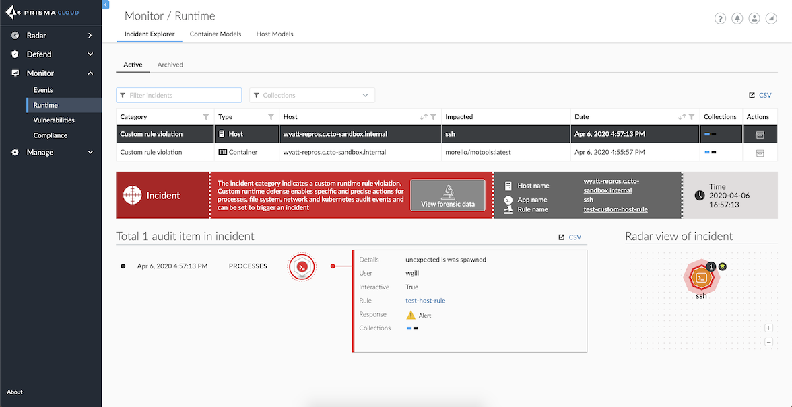
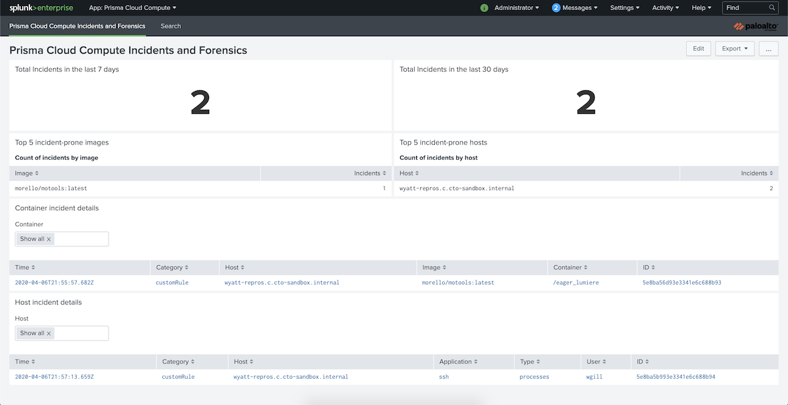
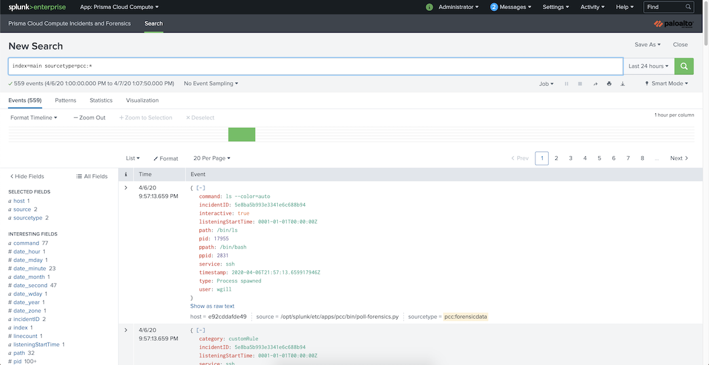

# Prisma Cloud Compute Splunk App

The Prisma Cloud Compute Splunk App allows high priority security incidents from Prisma Cloud Compute to be sampled by Splunk on a user-defined interval and provides in-depth forensic data for incident analysis and response.
The app adds two main components to your Splunk deployment: scripted data inputs that make use of your Prisma Cloud Compute API to pull incidents and forensics and a sample Splunk dashboard that presents that data.

_Note: For bringing in data besides incidents and forensics, please use syslog or webhooks._

## Important news

## Getting the app
### GitHub
Download the latest app tarball (`pcc-splunk-app-*.tar.gz`) from its [release page](https://github.com/PaloAltoNetworks/prisma-cloud-compute-splunk/releases/latest).

### Splunkbase
Download the latest app tarball from [Splunkbase](https://splunkbase.splunk.com/app/4555).

### Splunk Apps Browser
In the Splunk UI, click on the Apps dropdown, click "Find More Apps", then search for "Prisma Cloud Compute".

## Installation and setup
1. Install the app by either uploading the tarball or following the Splunkbase prompts.
2. Navigate to the setup page if you aren't guided there.
3. Fill out the setup form and click "Complete setup."
Field descriptions are on the setup page.
4. If on Windows, update `$SPLUNK_HOME\etc\twistlock\default\inputs.conf` according to the instructions at the top of the file.
4. Enable `poll_incidents.py` and `poll_forensics.py` at **Settings > Data inputs > Scripts** in Splunk.
5. (Optional) Adjust the schedule as needed. By default, the `poll_forensics.py` script runs 2 minutes after `poll_incidents.py` and both scripts will run every 5 minutes.

## FAQs
### What user role is required?
Any user role that is able to view incidents and forensic data. This is a user with at least the [DevSecOps role](https://docs.twistlock.com/docs/compute_edition/authentication/user_roles.html#devsecops-user) (self-hosted Compute) or [Account Group Read Only role](https://docs.twistlock.com/docs/enterprise_edition/authentication/prisma_cloud_user_roles.html#prisma-cloud-roles-to-compute-roles-mapping) (SaaS Compute).

### What is my SaaS Compute Console address?
You can find it at **Compute > Manage > System > Utilities** under the **Path to Console** heading.

### Where is the configuration stored?
Whenever you complete the setup, `local/twistlock.conf` and `local/passwords.conf` are created.
The passwords are stored and accessed using [Splunk's encrypted password storage APIs](https://www.splunk.com/en_us/blog/security/storing-encrypted-credentials.html).

## Troubleshooting
If incidents and/or forensics are not being ingested into Splunk, please verify the following:

- You have at least one incident at **Monitor > Runtime > Incident Explorer** under the "Active" tab.
- You are able to see the incident's forensic data by clicking on the "Forensic snapshot" button.
- The values in `local/twistlock.conf` and `local/passwords.conf` are correct.
If any are not correct, use the setup page with the same Console configuration name to update them.
- The app's scripts are enabled in Splunk (#4 in instructions), and have been ran at least once (#5 in instructions).

If data is still not being ingested, check `$SPLUNK_HOME/var/log/splunk/splunkd.log` for messages related to `poll_incidents.py` and `poll_forensics.py`:
```
index="_internal" source="/opt/splunk/var/log/splunk/splunkd.log" ("poll_incidents.py" OR "poll_forensics.py")
```

## Screenshots






## Support
This app is released with a "best effort" support policy.
We do not provide technical support or help in using or troubleshooting this app through our normal support options.
It should be seen as community-supported, and Palo Alto Networks will contribute when possible.

User contributions and feedback are welcome.
